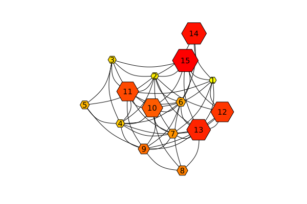
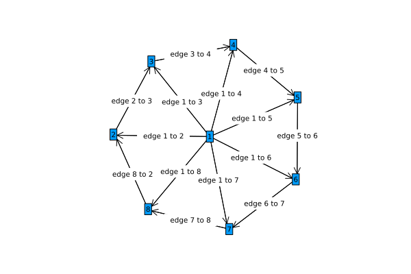
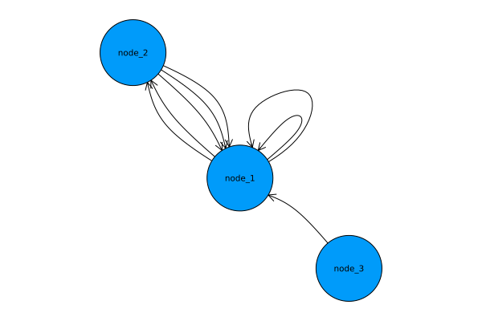
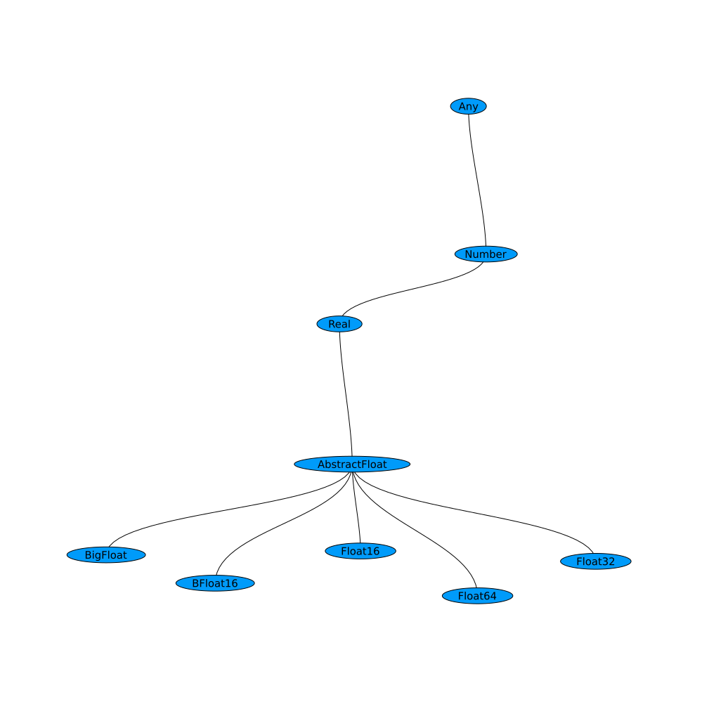
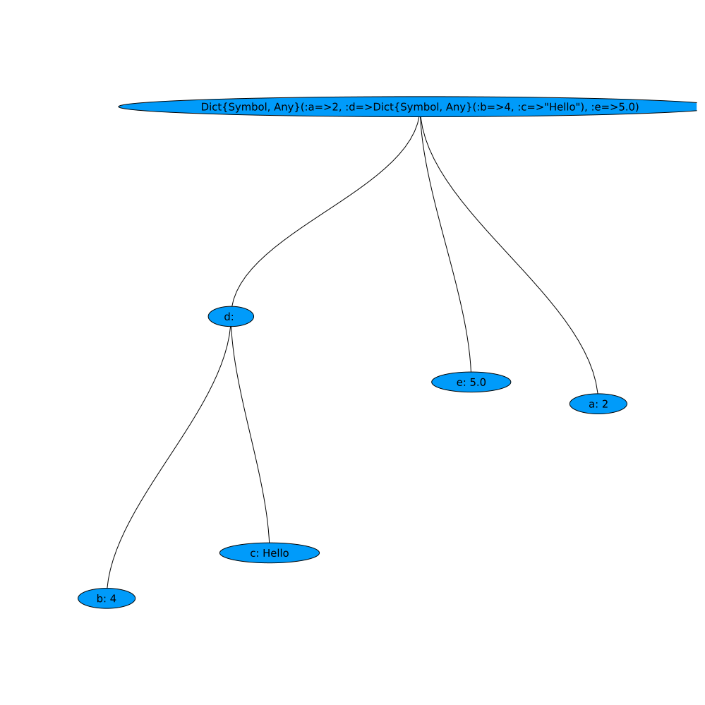

# GraphRecipes
The repository formerly known as PlotRecipes

[](https://travis-ci.org/JuliaPlots/GraphRecipes.jl)

### Primary author: Thomas Breloff (@tbreloff)

This repo maintains a collection of recipes for graph analysis, and is a reduced and refactored version of the previous PlotRecipes. It uses the powerful machinery of [Plots](https://github.com/tbreloff/Plots.jl) and [RecipesBase](https://github.com/JuliaPlots/RecipesBase.jl) to turn simple transformations into flexible visualizations.

# Examples

```julia
using GraphRecipes
using Plots

const n = 15
const A = Float64[ rand() < 0.5 ? 0 : rand() for i=1:n, j=1:n]
for i=1:n
    A[i, 1:i-1] = A[1:i-1, i]
end

graphplot(A,
          nodesize = 0.2,
          node_weights = 1:n,
          nodecolor = colormap("Oranges", n),
          names = 1:n,
          fontsize = 10,
          linecolor = :darkgrey,
          layout_kw = Dict(:x => x, :y => y),
          )
```



Now plot the graph in three dimensions.
```julia
graphplot(A,
           node_weights = 1:n,
           markercolor = :darkgray,
           dim = 3,
           markersize = 5,
           linecolor = :darkgrey,
           linealpha = 0.5
       )

```


### LightGraphs.jl
You can visualize a `LightGraphs.AbstractGraph` by passing it to `graphplot`.
```julia
using GraphRecipes, Plots
using LightGraphs

g = wheel_graph(10)
graphplot(g, curves=false)
```


#### Directed Graphs
I you pass `graphplot` a `LightGraphs.DiGraph` or an asymmetric adjacency matrix, then `graphplot` will use arrows to indicate the direction of the edges. Note that using the `arrow` attribute with the `pyplot` backend will allow you to control the aesthetics of the arrows.
```julia
using GraphRecipes, Plots
g = [0 1 1;
     0 0 1;
     0 1 0]

graphplot(g, names=1:3, curvature_scalar=0.1)
```


#### Edge Labels
Edge labels can be passed via the `edgelabel` keyword argument. You can pass edge labels
as a dictionary of `(si::Int, di::Int) => label`, where `si`, `di` are the indices of the source and destiny nodes for the edge being labeled. Alternatively, you can pass a matrix or a vector of labels. `graphplot` will try to convert any label you pass it into a string unless you pass one of `missing`, `NaN`, `nothing`, `false` or `""`, in which case, `graphplot` will skip the label.

```julia
using GraphRecipes, Plots
using LightGraphs

n = 8
g = wheel_digraph(n)
edgelabel_dict = Dict()
edgelabel_mat = Array{String}(undef, n, n)
for i in 1:n
    for j in 1:n
        edgelabel_mat[i, j] = edgelabel_dict[(i, j)] = string("edge ", i, " to ", j)
    end
end
edgelabel_vec = edgelabel_mat[:]

graphplot(g, names=1:n, edgelabel=edgelabel_dict, curves=false, nodeshape=:rect)  # Or edgelabel=edgelabel_mat, or edgelabel=edgelabel_vec.
```


#### Self edges
```julia
using LightGraphs, Plots

g = [0 1 1;
     0 1 0;
     0 1 0]

graphplot(g)
```

#### Multigraphs
```julia
graphplot([[1,1,2,2],[1,1,1],[1]], names="node_".*string.(1:3), nodeshape=:circle, self_edge_size=0.2)
```

#### Arc and chord diagrams

```julia
using LinearAlgebra
using SparseArrays
using GraphRecipes
using Plots

adjmat = Symmetric(sparse(rand(0:1,8,8)))

plot(
    graphplot(adjmat,
              method=:chorddiagram,
              names=[text(string(i), 8) for i in 1:8],
              linecolor=:black,
              fillcolor=:lightgray),

    graphplot(adjmat,
              method=:arcdiagram,
              markersize=3,
              linecolor=:black,
              markercolor=:black)
    )

```


#### Julia code -- AST

```julia
using GraphRecipes
using Plots
default(size=(1000, 1000))

code = :(
function mysum(list)
    out = 0
    for value in list
        out += value
    end
    out
end
)

plot(code, fontsize=12, shorten=0.01, axis_buffer=0.15, nodeshape=:rect)

```


#### Julia Type Trees

```julia
using GraphRecipes
using Plots
default(size=(1000, 1000))

plot(AbstractFloat, method=:tree, fontsize=10, nodeshape=:ellipse)

```



#### `AbstractTrees` Trees

```julia
using AbstractTrees

AbstractTrees.children(d::Dict) = [p for p in d]
AbstractTrees.children(p::Pair) = AbstractTrees.children(p[2])
function AbstractTrees.printnode(io::IO, p::Pair)
    str = isempty(AbstractTrees.children(p[2])) ? string(p[1], ": ", p[2]) : string(p[1], ": ")
    print(io, str)
end

d = Dict(:a => 2,:d => Dict(:b => 4,:c => "Hello"),:e => 5.0)

using GraphRecipes
using Plots
default(size=(1000, 1000))

plot(TreePlot(d), method=:tree, fontsize=10, nodeshape=:ellipse)

```

