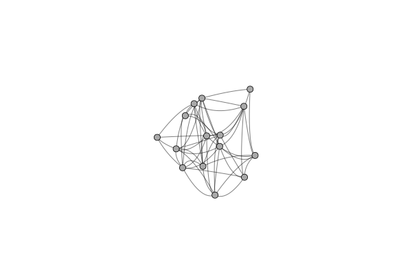

# GraphRecipes
The repository formerly know as PlotRecipes

[](https://travis-ci.org/JuliaPlots/GraphRecipes.jl)

### Primary author: Thomas Breloff (@tbreloff)

This repo maintains a collection of recipes for graph analysis, and is a reduced and refactored version of the previous PlotRecipes. It uses the powerful machinery of [Plots](https://github.com/tbreloff/Plots.jl) and [RecipesBase](https://github.com/JuliaPlots/RecipesBase.jl) to turn simple transformations into flexible visualizations.

# Examples

```julia
using GraphRecipes
using Plots

const n = 15
const A = Float64[ rand() < 0.5 ? 0 : rand() for i=1:n, j=1:n]
for i=1:n
    A[i, 1:i-1] = A[1:i-1, i]
end

graphplot(A,
          node_weights = 1:n,
          nodecolor = range(colorant"yellow", stop=colorant"red", length=n),
          names = 1:n,
          linecolor = :darkgrey,
       )

```


Now plot the graph in three dimensions.
```julia
graphplot(A,
           node_weights = 1:n,
           markercolor = :darkgray,
           dim = 3,
           markersize = 5,
           linecolor = :darkgrey,
           linealpha = 0.5
       )

```



#### Arc and chord diagrams

```julia
using LinearAlgebra
using SparseArrays
using GraphRecipes
using Plots

adjmat = Symmetric(sparse(rand(0:1,8,8)))

plot(
    graphplot(adjmat,
              method=:chorddiagram,
              names=[text(string(i), 8) for i in 1:8],
              linecolor=:black,
              fillcolor=:lightgray),

    graphplot(adjmat,
              method=:arcdiagram,
              markersize=3,
              linecolor=:black,
              markercolor=:black)
    )

```


#### Julia code -- AST

```julia
using GraphRecipes
using Plots

code = :(
function mysum(list)
    out = 0
    for value in list
        out += value
    end
    out
end
)

plot(code, fontsize=5, shorten=0.01, axis_buffer=0.15, nodeshape=:rect)

```


#### Julia Type Trees

```julia
using GraphRecipes
using Plots

plot(AbstractFloat, method=:tree, fontsize=4, nodeshape=:rect)

```

